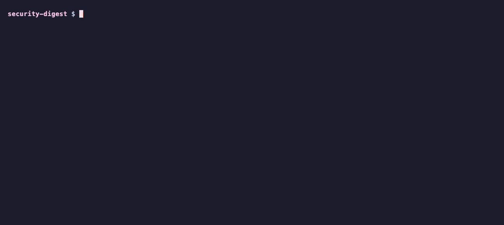
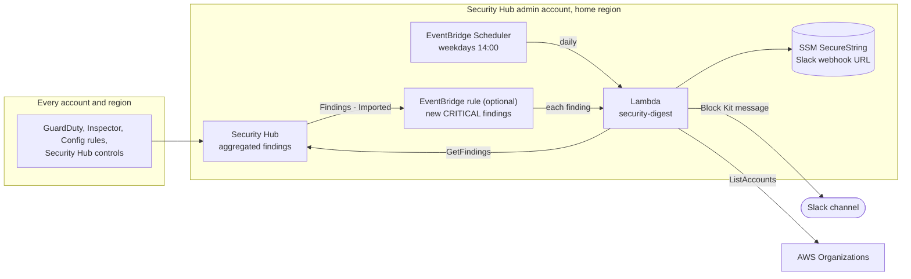

# security-digest

**A daily Slack summary of every active AWS Security Hub finding across an AWS Organization, grouped so a fleet-wide problem reads as one line, with patch health and newly introduced CVEs called out. Optional real-time alerts for new CRITICAL findings.**

Part of [aws-security-toolkit](https://github.com/simar-s2/aws-security-toolkit).



*`make preview` runs the Lambda's real query and formatting code against an in-memory Security Hub loaded with [fixtures/sample-findings.json](fixtures/sample-findings.json), and prints the Slack message in the terminal. No AWS account needed.*

## What it does

Security Hub is the right place to collect findings, but few people open its console every day. This Lambda function posts a short digest to a Slack channel on a schedule:

- **Findings by severity, grouped by title.** CRITICAL and HIGH by default. A control that fails on 40 instances is one row with a count and the affected account names, not 40 lines. Each section is capped, with an "… and N more" line.
- **A per-account rollup**, using account names from the findings or from AWS Organizations.
- **Patch status** from controls SSM.2 (missing patches) and SSM.3 (failed patch runs). SSM.3 is LOW severity, so a CRITICAL/HIGH view would otherwise never show that a patch run is failing.
- **New CVEs from the last 24 hours**, from Amazon Inspector. The full CVE backlog stays in Security Hub; the digest shows what newly pushed images and packages introduced, which is what a team can act on today.
- **Real-time alerts (optional).** An EventBridge rule sends each new CRITICAL finding to the same channel as it arrives.

It never fails silently: Slack's rejection reason is logged and the function errors, and every message is kept inside Slack's Block Kit limits (3,000 characters per text, 50 blocks), so a long section can't get the whole digest rejected.

**Tech:** Python 3.13 (standard library plus boto3), AWS Lambda, EventBridge Scheduler and rules, Security Hub, Terraform (AWS provider 6), CloudFormation, pytest, ruff, GitHub Actions.

## Architecture



It reads findings from the Security Hub delegated administrator's home region, where [org-security-baseline](https://github.com/simar-s2/org-security-baseline) aggregates every account and region, and patch data from [org-patch-manager](https://github.com/simar-s2/org-patch-manager) shows up through controls SSM.2 and SSM.3.

## Quick start

Create a Slack [incoming webhook](https://api.slack.com/messaging/webhooks) and store it in the security account, in the Security Hub home region. Keeping it in SSM keeps the URL out of Terraform state and CloudFormation parameters:

```bash
aws ssm put-parameter --name /security-digest/slack-webhook --type SecureString \
  --value "https://hooks.slack.com/services/..."
```

### Terraform

```hcl
module "security_digest" {
  source = "git::https://github.com/simar-s2/security-digest.git?ref=v0.1.0"

  webhook_parameter_name = "/security-digest/slack-webhook"
  schedule_timezone      = "America/New_York"
  schedule_expression    = "cron(0 9 ? * MON-FRI *)"
  realtime_alerts        = true      # optional
}
```

### CloudFormation

```bash
git clone https://github.com/simar-s2/security-digest && cd security-digest
scripts/deploy.sh --profile security --region us-east-1 --webhook-param /security-digest/slack-webhook
```

The script zips `src/`, uploads it to an artifact bucket (created if missing, with public access blocked) under a content-hash key, and deploys the stack.

Send a digest right away with `aws lambda invoke --function-name sec-security-digest /dev/stdout`.

## Configuration

### Terraform inputs

| Name | Type | Default | Description |
|---|---|---|---|
| `webhook_parameter_name` | `string` | required | SSM SecureString with the webhook URL |
| `webhook_kms_key_arn` | `string` | `null` | Customer managed key of that parameter, if any |
| `name_prefix` | `string` | `sec` | Prefix for every name |
| `schedule_expression` | `string` | `cron(0 14 ? * MON-FRI *)` | When the digest is sent |
| `schedule_timezone` | `string` | `UTC` | IANA time zone of the schedule |
| `title` | `string` | `AWS security daily digest` | Message heading |
| `severities` | `list(string)` | `["CRITICAL", "HIGH"]` | Severities in the main tables |
| `excluded_products` | `list(string)` | Inspector, Patch Manager | Kept out of the main tables (they have their own sections) |
| `max_rows` | `number` | `15` | Rows per section before "… and N more" |
| `include_new_cves` | `bool` | `true` | New Inspector CVEs section |
| `include_patch_status` | `bool` | `true` | SSM.2 / SSM.3 patch section |
| `footer` | `string` | `""` | Text before the console link |
| `realtime_alerts` | `bool` | `false` | EventBridge rule for real-time alerts |
| `realtime_severities` | `list(string)` | `["CRITICAL"]` | Severities that alert in real time |
| `log_retention_days` | `number` | `90` | Function log retention |

### Terraform outputs

`function_name`, `function_arn`, `schedule_name`, `realtime_rule_arn`.

### CloudFormation parameters

The same settings as the Terraform inputs, in PascalCase (`ScheduleExpression`, `Severities`, `RealtimeAlerts`, …). Pass them to the deploy script with `--param Key=Value`.

## Cost

Effectively free for most organizations. The function runs for a few seconds once a day (well inside the Lambda free tier), EventBridge Scheduler's free tier covers the schedule, and `GetFindings` calls are not billed. The real-time rule adds one short invocation per new CRITICAL finding. Security Hub itself is billed separately (see [org-security-baseline](https://github.com/simar-s2/org-security-baseline#cost)).

## Design notes

- **Grouped by title, not listed.** In a real organization one misconfiguration usually fails across many resources. Grouping turns 200 findings into a table a person will read.
- **CVEs have their own section.** Tens of thousands of container CVE findings would drown the posture signal. They stay active in Security Hub as the backlog, and the digest shows only the ones first seen in the last 24 hours.
- **Patch findings are rolled up.** Patch Manager emits one finding per instance. The digest counts SSM.2 and SSM.3 per account instead, and the SSM.3 line appears even on a day with no CRITICAL or HIGH findings.
- **Real-time alerts skip what the digest covers.** The rule leaves out Inspector, Patch Manager and SSM.2 control findings by title prefix (they arrive as Security Hub control findings, so a product filter can't catch them), and only CRITICAL alerts by default: HIGH volume is better read once a day.
- **Old findings don't re-alert.** Security Hub re-imports a finding every time it's updated, so the function ignores findings created more than 24 hours earlier.
- **The webhook URL is a secret.** It lives in an SSM SecureString, and Terraform and CloudFormation only ever see the parameter name.
- **Tested without AWS.** `security_digest.local` is an in-memory Security Hub with the same filter semantics the queries rely on (EQUALS OR-ed, NOT_EQUALS AND-ed, date ranges), so the tests and the preview run the real query code.

## Project layout

```
src/security_digest/     the Lambda: handler, queries, Block Kit rendering, Slack, settings
src/security_digest/local.py    in-memory Security Hub and Organizations (tests, preview)
src/security_digest/preview.py  terminal preview
fixtures/                sample findings for the preview and tests
main.tf, variables.tf, … Terraform module
cloudformation/          CloudFormation template
scripts/deploy.sh        package, upload and deploy with CloudFormation
examples/                Terraform examples
tests/                   pytest suites and terraform test
```

## Development

```bash
make test       # pytest and terraform test; nothing calls AWS
make lint       # terraform fmt/validate, tflint, cfn-lint, checkov, shellcheck, ruff
make preview    # render the sample digest in the terminal
PYTHONPATH=src python3 -m security_digest.preview fixtures/sample-findings.json --json   # the Slack payload
```

Paste the `--json` output into Slack's [Block Kit Builder](https://app.slack.com/block-kit-builder) to see exactly how the message will look.

## License

[MIT](LICENSE)
